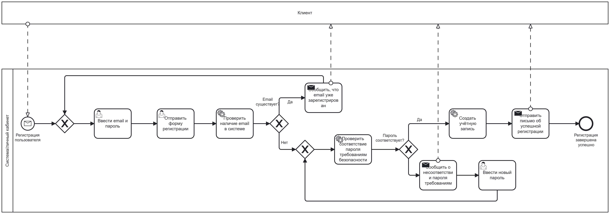
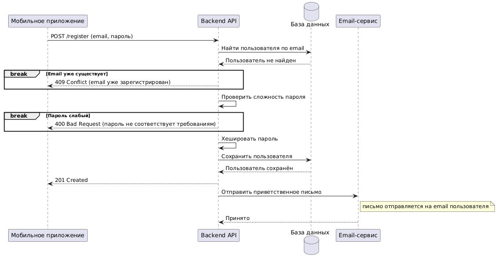

Тестовое 2
Спроектируйте процесс регистрации и аутентификации пользователя в мобильном приложении интернет-магазина (email + пароль, вход через Google/Apple, восстановление пароля).

Требуется:
1. BPMN-диаграмма процесса регистрации (happy path + обработка ошибок: email уже существует, слабый пароль).
2. UML Sequence Diagram: Мобильное приложение → Backend API → База данных → Email-сервис.
3. Список из 5–7 функциональных и 3 нефункциональных требований.
4. Acceptance Criteria для одной User Story в формате Given/When/Then.
Время: до 40 минут. Инструменты: бумага/Draw.io/PlantUML.

1. 

2. 

@startuml
participant "Мобильное приложение" as App
participant "Backend API" as API
database "База данных" as DB
participant "Email-сервис" as Mail
 
 App -> API: POST /register (email, пароль)
 API -> DB: Найти пользователя по email
 DB --> API: Пользователь не найден
 break Email уже существует
    API --> App: 409 Conflict (email уже зарегистрирован)
  end
 API -> API: Проверить сложность пароля
break Пароль слабый
    API --> App: 400 Bad Request (пароль не соответствует требованиям)
  end
 API -> API: Хешировать пароль
 API -> DB: Сохранить пользователя
 DB --> API: Пользователь сохранён
 API --> App: 201 Created
 API -> Mail: Отправить приветственное письмо
 note right of Mail: письмо отправляется на email пользователя
 Mail --> API: Принято
@enduml

3. Список из 5–7 функциональных и 3 нефункциональных требований.

нфт
1. Система должна быть доступна 99.9% времени
2. Время отклика системы при регистрации должно составлять не более 3 секунд
3. Система должна передавать данные только по HTTPS и хранить пароли в хешированном виде

фт
1. Система должна позволять зарегистрироваться пользователю в личном кабинете по email и паролю
2. Система должна позволять пользователю вход в личный кабинет по email и паролю
3. Система должна  предоставлять возможность входа через Google/Apple
4. Система должна предоставлять пользователю возможность при необходимости восстанавливать пароль по ссылке, отправленной на email
5. Система должна выполнять проверку введенного пользователем email на присутствие дубликатов и если дубликат в базе найден, отказывать в регистрации и выводить уведомление, что такой email уже зарегистрирован, нужно повторить попытку с другим email.
6. Система должна проверять пароль на соответствие требованиям- буквы строчные и заглавные, цифры и спецсимволы
7. Система должна отправлять пользователю письмо на email после успешной регистрации

4. Acceptance Criteria для одной User Story в формате Given/When/Then.
Время: до 40 минут. Инструменты: бумага/Draw.io/PlantUML.

User Story
как пользователь, я хочу зарегистрироваться в приложении по email и паролю, чтобы оформлять заказы и отслеживать их статус

Критерии приемки

1. Успешная регистрация
Given пользователь находится на экране регистрации и email еще не зарегистрирован в системе
When пользователь вводит email и пароль, соответствующий требованиям, и нажимает Зарегистрироваться
Then система создает учетную запись, показывает сообщение об успешной регистрации и отправляет письмо на указанный email

2.Email уже существует
Given пользователь находится на экране регистрации, и email уже существует в системе
When пользователь вводит этот email и пароль, соответствующий требованиям, и нажимает Зарегистрироваться
Then система не создает учетную запись и показывает сообщение «Пользователь с таким email уже зарегистрирован»

3. Пароль не соответствует требованиям
Given пользователь находится на экране регистрации, и email не зарегистрирован в системе
When пользователь вводит email и пароль, не соответствующий требованиям (например, «12345»), и нажимает Зарегистрироваться
Then система не создает учетную запись и показывает сообщение о несоответствии пароля требованиям.
